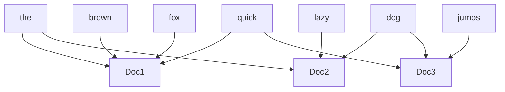
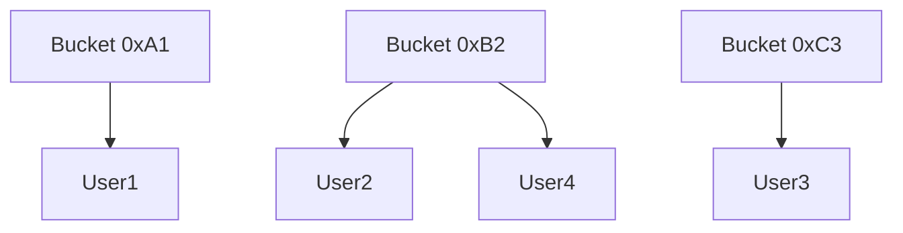
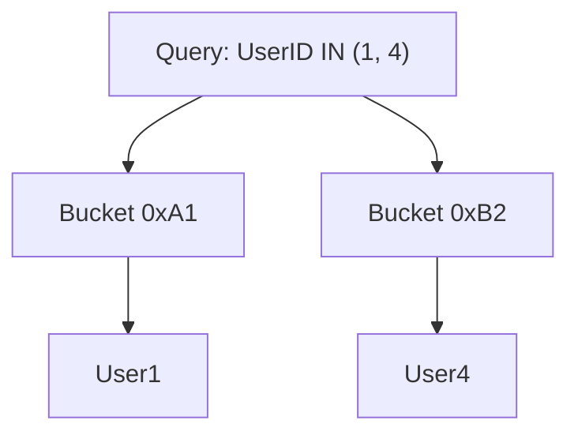

# Indexes
Indexes are well known when it comes to databases. Sooner or later there comes a time when database performance is no longer satisfactory. One of the very first things you should turn to when that happens is database indexing.
An index is a data structure that can be perceived as a table of contents that points us to the location where actual data lives.

## Purpose of Indexes
- **Faster Data Retrieval:** Indexes significantly speed up query execution by providing a more efficient means of locating data, which can lead to a reduction in the number of disk I/O operations and CPU usage.

- **Sorting and Ordering:** Indexes can be used to quickly sort and order the data in a table based on specific criteria, which can be useful for reporting or displaying data in a specific order.

## Indexes Improve Query Performance
- **Reduced Table Scans:** By using an index, the database can avoid full table scans, which require reading every row in a table. Instead, the database can directly access the indexed columns, reducing the amount of data that needs to be read and processed.

- **Efficient Data Access:** Indexes provide a more efficient means of accessing data by organizing it in a way that allows the database to quickly locate the rows that meet the query criteria.

- **Index Selectivity:** Indexes with high selectivity can improve query performance by reducing the number of rows that need to be accessed. High selectivity means that the index can effectively filter out a large number of rows, thereby reducing the amount of work required to process a query.

## Indexes decrease write performance
While indexes can significantly improve query performance, they also come with some overhead.
Indexes require additional storage space and can slow down write operations, such as INSERT, UPDATE, and DELETE, since the indexes must be updated along with the table data.
When adding rows or making updates to existing rows for a table with an active index, we not only have to write the data but also have to update the index.

## Types of Indexes
There are various types of database indexes, each with its unique characteristics and use cases.

### Primary Index
Primary Index is the index on a table’s primary key. The primary key is a column (or set of columns) that uniquely identifies each row. Most relational databases automatically create an index on the primary key to enforce uniqueness and allow fast lookup by the primary key.

There can only be one primary index per table because a table has only one primary key.

Improves read performance for identifying specific rows Like;
```sql
SELECT * FROM Employees WHERE EmployeeID = 123
```
After this, any SELECT or join by Email can use the index, and any attempt to insert a duplicate email will be blocked by the index.

### Unique Index
A Unique Index is an index that enforces the uniqueness of the values in one or more columns. This means that no two rows can have the same value in the indexed columns. Guarantee data integrity by preventing duplicates.

Example Many to Many relationship table.

Example email unique index, (since we may use userId to primary key).
```sql
CREATE UNIQUE INDEX idx_users_email ON Users(Email);
```
The trade-off is on writes: whenever a new row is inserted or an indexed column is updated, the database must check the unique index to ensure no duplicate value exists. This means inserts/updates can be a bit slower due to the uniqueness check. However, this cost is usually worth it to maintain data correctness. Storage overhead for a unique index is similar to a normal index.

### Clustered Index
A Clustered Index determines the physical order of data in a table. The table’s rows are stored on disk in the same order as the index key.

A table can have only one clustered index because the data rows can be sorted one way on disk.

Often, the primary key serves as the clustered index by default (e.g., in SQL Server). However, you can create a clustered index on a different column if it makes sense for your queries.

If a table has a clustered index, other indexes on that table are called **non-clustered** (or secondary) indexes.

Clustered indexes thus shine for range scans, ordering, and grouping by the indexed column.
A classic use case is a date/timestamp column for a log or history table.
Always query a customer table sorted by LastName, a clustered index on LastName makes sens.
```sql
-- Cluster the Customer table by last name, then first name (alphabetical order)
CREATE CLUSTERED INDEX idx_cust_name ON Customers(LastName ASC, FirstName ASC);
```
This physically sorts the Customers table by last name and first name

*Trade-offs* writes in the middle can be slower because inserting a new row may require rearranging existing rows to maintain the index order. Also, there is some storage overhead for maintaining the index structure. Updates to the indexed column can be more expensive for the same reason.

### Non-Clustered Index
Suppose you have the following Employees table:

| EmployeeID | Name      | Department |
|------------|-----------|------------|
| 1          | Alice     | HR         |
| 2          | Bob       | IT         |
| 3          | Carol     | Finance    |
| 4          | Dave      | IT         |

If you frequently query employees by Department, you can create a non-clustered index on the Department column:

```sql
CREATE NONCLUSTERED INDEX idx_emp_dept ON Employees(Department);
```
The non-clustered index itself might look like this:

| Department | Pointer to Row |
|------------|----------------|
| Finance    | → Row 3        |
| HR         | → Row 1        |
| IT         | → Row 2        |
| IT         | → Row 4        |

Each entry in the index table stores the value from the indexed column and a pointer (reference) to the actual row in the Employees table.

This index allows fast lookups for queries like:
```sql
SELECT * FROM Employees WHERE Department = 'IT';
```
The index stores Department values and pointers to the corresponding rows, while the actual table data remains physically ordered by the clustered index (usually the primary key).
In a non-clustered index, the index structure (typically a B-tree) stores the indexed column values and pointers (references) to the actual table rows that contain the rest of the data

#### Trade-Offs
- **Read Performance:** Non-clustered indexes greatly improve read/query speed for the indexed columns, especially for selective queries.
- **Write Performance:** Inserts, updates, and deletes are slower because the index must be updated whenever the underlying data changes.
- **Storage Overhead:** Each non-clustered index requires additional disk space to store the index structure.
- **Multiple Indexes:** You can create multiple non-clustered indexes per table, but each additional index increases write overhead and storage usage.


### Composite Index
A Composite Index (or multi-column index) is an index that includes multiple columns from a table. The index treats the combined set of columns as a single search key. For example, an index on (LastName, FirstName) in a table effectively sorts by LastName then FirstName together.

Most databases use a leftmost prefix rule: the index can be used for a query that filters on the first column, or on the first and second.

A classic example is a table of addresses with columns (City, State);
composite indexes can save space and maintenance costs compared to separate indexes on each column City and State.
```sql
CREATE INDEX idx_address_city_state ON Addresses(City, State);
```

Orders table where queries ask for orders by Customer within a certain Date – an index on (CustomerID, OrderDate) would efficiently support.
```
WHERE CustomerID = ? AND OrderDate BETWEEN ...
```

```sql
CREATE INDEX idx_orders_cust_date ON Orders(CustomerID, OrderDate);
```
This single index can accelerate queries like;
```sql
SELECT * FROM Orders WHERE CustomerID = 42 AND OrderDate >= '2024-01-01' AND OrderDate < '2024-02-01';
```
Because it will find the customer 42’s orders and then filter by the date range in one index traversal. It will also help a query **WHERE CustomerID = 42** alone (using the leftmost CustomerID part).

However, a query filtering only by OrderDate (without CustomerID) cannot use this index efficiently because **OrderDate** is the second component. In summary, this composite index targets queries that specify a customer and a date or date range.

### Full-Text Index
A Full-Text Index is a specialized index for text search. Unlike a normal index which treats an entire column value as a single entry, a full-text index breaks text data into words or tokens, enabling fast lookups for words, phrases, and supporting advanced queries like ranking and relevance. It is commonly used for search features in applications, such as finding articles or products by keywords.

Use a full-text index for columns containing large unstructured text that users need to search through. Typical use cases are: article or blog content, product descriptions (for e-commerce search), document repositories, comment or message text, etc.
```sql
-- Full-text index on the Content column of an Articles table (MySQL example)
CREATE FULLTEXT INDEX idx_articles_content ON Articles(Content);
```

Full-text indexes are typically implemented as an inverted index: it maps each word (term) to a list of documents or rows that contain that word.

#### Trade-Offs
- **Performance Overhead:** Building and maintaining a full-text index can be resource-intensive, especially for large datasets or frequent updates.
- **Write Latency:** Index updates may slow down insert and update operations, so many systems batch-process or update full-text indexes asynchronously to reduce impact on write performance.
- **Storage Usage:** Full-text indexes require significant additional storage to maintain word-to-document mappings.

**Example Table:**

Suppose you have the following documents table:

| DocID | Content                      |
|-------|------------------------------|
| 1     | The quick brown fox          |
| 2     | The lazy dog                 |
| 3     | Quick dog jumps              |

The inverted index would look like:

| Word   | DocIDs      |
|--------|-------------|
| the    | 1, 2        |
| quick  | 1, 3        |
| brown  | 1           |
| fox    | 1           |
| lazy   | 2           |
| dog    | 2, 3        |
| jumps  | 3           |

**Mermaid Diagram:**



Traditional B-tree indexes cannot efficiently handle LIKE '%keyword%' searches because they are not optimized for arbitrary substring matches.

Another consideration is that full-text search engines typically operate with specific queries (e.g., using **MATCH() ... AGAINST()** in MySQL or **CONTAINS()** in SQL Server) – the query engine needs to use the full-text search mechanism explicitly.

### Hash Index
A Hash Index uses a hash table internally for indexing, rather than a tree structure.
In a hash index, the index key (e.g., a value from a column) is run through a hash function which determines which "bucket" or slot the pointer to the row will be stored in.

```sql
-- PostgreSQL: Create a hash index on the CustomerCode column
CREATE INDEX idx_customer_code_hash ON Customers USING HASH(CustomerCode);
```

**Example Table:**

Suppose you have a Users table:

| UserID | Name   |
|--------|--------|
| 1      | Alice  |
| 2      | Bob    |
| 3      | Carol  |
| 4      | Dave   |

The hash index might look like:

| Hash Bucket | UserID (Pointer) |
|-------------|------------------|
| 0xA1        | 1                |
| 0xB2        | 2                |
| 0xC3        | 3                |
| 0xB2        | 4                |

Here, UserID 2 and 4 both hash to bucket 0xB2 (a collision), so both pointers are stored in that bucket.

**Mermaid Diagram:**




Hash indexes are excellent for equality lookups (using **=** or **IN** comparisons) but cannot be used for range scans (< or > or BETWEEN queries) or for sorting.

**Example Query:**
Suppose you want to find users with UserID IN (1, 4):

| Hash Bucket | UserID (Pointer) |
|-------------|------------------|
| 0xA1        | 1                |
| 0xB2        | 2, 4             |
| 0xC3        | 3                |

The database hashes 1 and 4, finds bucket 0xA1 for UserID 1 and bucket 0xB2 for UserID 4, and retrieves the corresponding rows.

**Mermaid Diagram:**



For a single equality lookup (e.g., UserID = 3), the database hashes 3, finds bucket 0xC3, and retrieves User3.
In detail, when you run a query like **UserID IN (1, 4)**, the database:
1. Applies a hash function to each UserID (1 and 4).
2. The hash function outputs a bucket value for each key (e.g., 1 -> 0xA1, 4 -> 0xB2).
3. The database looks up each bucket and finds pointers to the rows for those UserIDs.
4. If a bucket contains multiple pointers (due to hash collisions), the database checks each pointer in the bucket to find the exact match.

This process is very fast for equality lookups because the hash function quickly narrows down the search to a specific bucket, rather than scanning all rows or traversing a tree. However, hash indexes are not suitable for range queries (e.g., UserID > 2) because the hash function does not preserve order.

