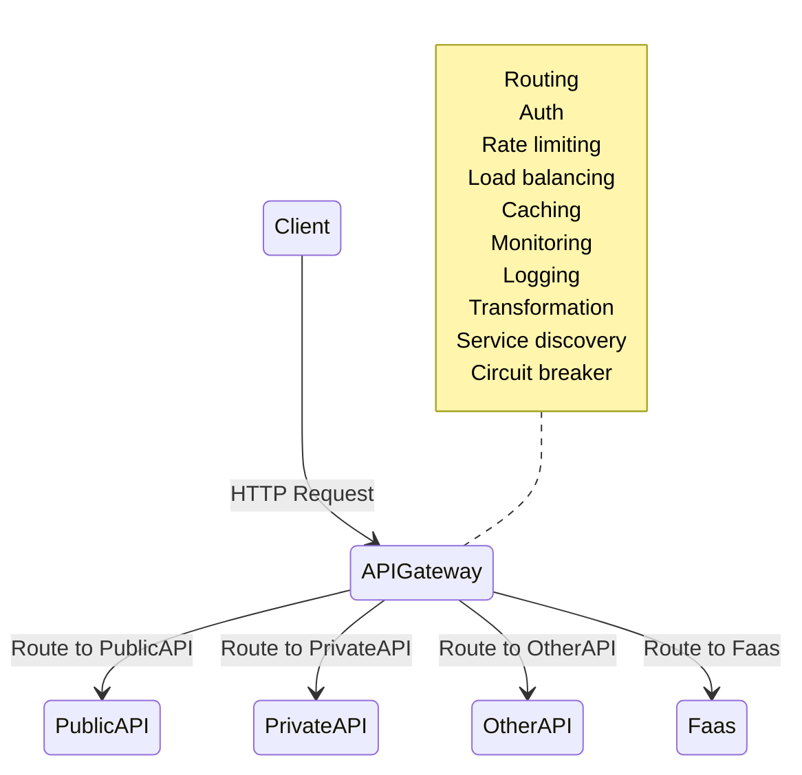

# API Gateway

An API Gateway is a server-side architectural component in a software system that acts as an intermediary between clients (such as web browsers, mobile apps, or other services) and backend services, microservices, or APIs.

Its main purpose is to provide a single entry point for external consumers to access the services and functionalities of the backend system. It receives client requests, forwards them to the appropriate microservice, and then returns the server’s response to the client.

The API gateway is responsible for tasks such as routing, authentication, and rate limiting. This enables microservices to focus on their individual tasks and improves the overall performance and scalability of the system.

## Uses
1. **Request Routing**
Usage: Directing incoming client requests to the right backend service.

    Example: We have an e-commerce application with separate services for user management, product catalog, and order processing. When a client requests product details, the API Gateway routes this request to the product catalog service. If the client wants to place an order, the gateway directs the request to the order processing service.

2. **Aggregation/Group of Multiple Services**
Usage: Combining responses from multiple backend services into a single response to the client.

    Example: A mobile app needs to display user profile information along with recent orders and recommendations. Instead of the client making separate requests to each service, the API Gateway can fetch data from the user service, order service, and recommendation service, then compile and send a unified response to the client.

3. **Security Enforcement**
Usage: Implementing security measures such as authentication, authorization, and rate limiting.

    Example: Before a request reaches any backend service, the API Gateway can verify the user's authentication token to ensure they are logged in. It can also check if the user has the necessary permissions to access certain data and limit the number of requests from a single user to prevent abuse.

4. **Load Balancing**
Usage: Distributing incoming requests evenly across multiple instances of backend services to ensure no single service becomes a bottleneck.

    Example: If our application experiences high traffic, the API Gateway can distribute incoming requests for the product catalog service across several server instances, ensuring efficient use of resources and maintaining performance.

5. **Caching Responses**
Usage: Storing frequently requested data to reduce latency and decrease the load on backend services.

    Example: If the product catalog doesn't change frequently, the API Gateway can cache product information. When a client requests product details, the gateway can serve the cached data instead of querying the product catalog service every time, resulting in faster response times.

6. **Protocol Translation**
Usage: Converting requests and responses between different protocols used by clients and backend services.

    Example: A client might send requests over HTTP/HTTPS, while some backend services communicate using WebSockets or gRPC. The API Gateway can handle the necessary protocol conversions, allowing seamless communication between clients and services.

7. **Monitoring and Logging**
Usage: Tracking and recording request and response data for analysis, debugging, and performance monitoring.

    Example: The API Gateway can log all incoming requests, including details like request paths, response times, and error rates. This information is invaluable for identifying performance issues, understanding usage patterns, and troubleshooting problems.

8. **Transformation of Requests and Responses**
Usage: Modifying the data format or structure of requests and responses to meet the needs of clients or services.

    Example: Suppose a client expects data in JSON format, but a backend service provides data in XML. The API Gateway can transform the XML response into JSON before sending it to the client, ensuring compatibility without requiring changes to the backend service.

9. **API Versioning**
Usage: Managing different versions of APIs to ensure backward compatibility.

    Example: We have a mobile app that connect on your backend services. When we update the API to add new features or make changes, older versions of the app might still need to interact with the previous API version. The API Gateway can route requests to different backend service versions based on the API version specified in the request, ensuring that both old and new clients operate without error.

10. **Rate Limiting and Throttling**
Usage: Controlling the number of requests a client can make in a given time frame to protect backend services from being overwhelmed.

Example: When API is public accessible and we want to prevent any single user from making too many requests in a short period. The API Gateway can enforce rate limits, such as allowing a maximum of 100 requests per minute per user. If a user exceeds this limit, the gateway can temporarily block further requests, ensuring fair usage and maintaining service stability.

11. **API Saving Cost**
Usage: Businesses cost, usage tiers, and billing.

    Example: A company provides a public API for accessing weather data. Using an API Gateway, they can create different subscription tiers (e.g., free, basic, premium) with varying levels of access and usage limits. The gateway can handle authentication, track usage based on subscription plans, and integrate with billing systems to charge users. This setup allows the company to generate revenue from their API offerings effectively.

12. **Service Discovery Integration**
Usage: Facilitating dynamic discovery of backend services, especially in environments where services are frequently scaled up or down.

    Example: In a microservices environment using Kubernetes, services can scale dynamically based on demand. The API Gateway can integrate with a service discovery tool (like Consul or Eureka) to automatically route requests to the appropriate service instances, even as they change. This ensures that clients always connect to available and healthy service instances without manual configuration.

13. **Circuit Breaker Pattern Implementation**
Usage: Preventing cascading failures by detecting when a backend service is failing and stopping requests to it temporarily.

    Example: If we order processing service is experiencing issues and becomes unresponsive, the API Gateway can detect the failure pattern and activate a circuit breaker. This means the gateway will stop sending new requests to the problematic service for a specified period, allowing it time to recover. During this time, the gateway can return fallback responses to clients, maintaining overall system stability.

14. **Content-Based Routing**
Usage: Routing requests to different backend services based on the content of the request, such as headers, body, or query parameters.

    Example: Handles different types of media uploads (images, videos, documents). The API Gateway can inspect the Content-Type header of incoming requests and route them to specialized backend services optimized for handling each media type. This ensures that each type of content is processed efficiently by the appropriate service.

15. **SSL Termination**
Usage: **Handling SSL/TLS encryption and decryption at the gateway level to offload this resource-intensive task from backend services.**

    Example: Instead of each backend service managing its own SSL certificates and handling encryption, the API Gateway can terminate SSL connections. Clients communicate securely with the gateway over HTTPS, and the gateway forwards requests to backend services over HTTP or a secure internal network. This simplifies certificate management and reduces the other load on backend services.

16. **Policy Enforcement**
Usage: Applying organizational policies consistently across all API traffic, such as data validation, request formatting, and access controls.

    Example: A Organization might have policies requiring that all incoming data be validated for specific fields or that certain headers are present in requests. The API Gateway can enforce these policies by validating incoming requests before they reach backend services. If a request doesn't have it, the gateway can reject it with an error message, ensuring that only well-formed and authorized requests are processed.

17. **Multi-Tenancy Support**
Usage: Supporting multiple clients or tenants within a single API infrastructure while ensuring data isolation and customized configurations.

    Example: A SaaS platform serves multiple businesses, each considered a tenant. The API Gateway can split between tenants based on headers or authentication tokens and route requests to tenant-specific services or databases. It can also apply tenant-specific rate limits, logging, and security policies, ensuring that each tenant operates in a secure and isolated environment.

18. **Localization and Internationalization Support**
Usage: Adapting responses based on the client's locale, such as language preferences or regional settings.

    Example: If an application serves users in different countries, the API Gateway can detect the user's locale from request headers or parameters and modify responses accordingly. For instance, it can format dates, numbers, or currencies to match the user's regional standards or serve localized content by fetching data from region-specific backend services.

19. **Reducing Client Complexity**
Usage: Simplifying the client-side logic by handling complex operations on the server side through the gateway.

    Example: A client application might need to perform multiple operations to complete a user registration process, such as creating a user account, sending a welcome email, and logging the registration event. Instead of the client making separate API calls for each operation, the API Gateway can expose a single endpoint that orchestrates these actions behind the scenes. This reduces the complexity of the client code and minimizes the number of network requests.

## Pros
- Improved Performance: By offloading tasks rate limiting, caching to the API Gateway, backend services can focus on their core functionalities, leading to better performance and scalability.
- Simplified system Architecture: The API Gateway provides a unified entry point for clients, simplifying the architecture and making it easier to manage and maintain.
- Enhanced Security: Enforcing authentication, authorization, and other security measures at the gateway level. Help developer focus implementing business logic in a service without worrying about security concerns.
- Improved Scalability: The API Gateway can handle a large number of concurrent requests and distribute them efficiently across backend services, allowing the system to scale more effectively.
- API Versioning and backward compatibility: The API Gateway can manage different versions of APIs, ensuring that older clients can still access the services without disruption.
- Enhanced Error Handling: Centralizing error handling at the gateway level allows for consistent responses to clients and easier debugging of issues.

## Cons
- Add Complexity: Introducing an API Gateway adds an additional layer to the system architecture, which can increase complexity and require additional maintenance.
- Single Point of Failure: If the API Gateway goes down, it can disrupt access to all.
- Latency: The additional hop through the API Gateway can introduce latency, especially if the gateway is not optimized or if it becomes a bottleneck.
- Cost: Implementing and maintaining an API Gateway can incur additional costs, especially if using a third-party service or solution.
- Maintenance Overhead: The API Gateway requires ongoing maintenance, updates, and monitoring to ensure it operates effectively and securely.
- Configuration Complexity: Setting up and configuring an API Gateway can be complex, especially in large systems with many services and diverse requirements.

## Difference from a load balancer
An API gateway is focused on routing requests to the right microservice, while a load balancer is focused on distributing requests evenly across a group of backend servers.

