# Caching
high speed data storage layer that sit between the client and the main data source (like a database or an API) to store frequently accessed data temporarily. This allows for quicker data retrieval, reducing latency and improving overall system performance.

## Key Concepts
1. **Cache**: A temporary storage area that holds a subset of data, typically the most frequently accessed or recently used data, to speed up future requests.
2. **Cache Hit**: When a requested data item is found in the cache, allowing for quick retrieval without accessing the main data source.
3. **Cache Miss**: When a requested data item is not found in the cache, need to be fetched from the main data source.
4. **Cache Eviction**: The process of removing data from the cache to make space for new data, often based on specific policies.
5. **Cache Staleness**: Cached data being outdated compared to the main data source, which can lead to inconsistencies if not managed properly.

## Why Use Caching?
- **Performance Improvement**: Caching reduces the time it takes to retrieve main data, leading to faster response times for users.
- **Reduced latency**: Serving data from a cache is typically much faster than querying a database.
- **Reduced network Load**: By serving repeated requests from the cache, it decreases the load on the main data source and network traffic.
- **Scalability**: Caching can help systems handle higher loads by reducing the number of direct requests to the main data source.
- **Better User Experience**: Faster data retrieval leads to a more responsive application, enhancing user satisfaction.

## Types of Caches
1. **In-Memory Cache**: Stores data in the RAM of the application server which faster than disk-based storage.
2. **Disk Cache**: Stores data on disk, which is slower than in-memory but faster than fetching from the main data source.
3. **Database Cache**: this type is useful for data that is stored in a database and frequently accessed by multiple users. Database caching can be implemented using a variety of techniques, including database query caching and result set caching.
4. **Client-Side Cache**: Caches data on the client side, such as in a web browser, mobile app. Stored data can include HTML pages, images, or javascript files, reduce the need for repeated requests to the server. Examples of client-side caching include browser caching and local storage.
5. **Server-Side Cache**: Used to store frequently accessed data, precomputed results, or intermediate processing results to improve the performance of the server. Examples of server-side caching include full-page caching, fragment caching, and object caching.
6. **CDN Cache**: Content Delivery Networks (CDNs) caching stores data on a distributed network of servers, reducing the latency of accessing data from remote locations. This type of caching is useful for data that is accessed from multiple locations around the world, such as images, videos, and other static assets. CDN caching is commonly used for content delivery networks and large-scale web applications.
7. **DNS Cache**: Caches DNS query results to reduce the time it takes to resolve domain names to IP addresses.
8. **Distributed Cache**: A cache that is shared across multiple servers or nodes in a distributed system, allowing for data to be cached and accessed from multiple locations. Examples of distributed caching systems include Memcached and Redis.
 
 ```mermaid
flowchart TB

    subgraph Main
        direction TB
        Client(["💻 Client"])
        LB["Load Balancer"]
        subgraph Gateways["API Gateways"]
            direction TB
            APIGateway1["API Gateway 1"]
            APIGateway2["API Gateway 2"]
        end
        AppServers@{shape: processes, label: "App Servers"}
        direction TB
        Client --> LB
        LB --> Gateways
        Gateways --> AppServers --> DistrubtedCache("Distrubted Cache Redis/Memcached") --> DB
        

        subgraph DB["Metadata DBs"]
            direction TB
            id1[(Database)]
            id2[(Database)]
            id3[(Database)]
        end
    end

    CSC["`**Client-Side Cache** 
      Browser Cache, 
      Sestion storage Cache,
      Application Cache,
      Local storage Cache,
      IndexedDB
    `"]
    
    LBC["`**Load Balancer Cache** 
      Session Persistance Cache,
      Revert Proxy Cache,
      SSL/TLS Session Cache,
      Application Cache
    `"]

    AGC["`**API Gateway Cache** 
      Response Cache,
      Result Cache,
      Authorization Cache,
      Session Cache
    `"]

    ASC["`**App Server Cache** 
      API Response Cache,
      Application Cache,
      Distributed Cache,
      Database Cache
    `"]

    DBC["`**Database Cache** 
      Query Cache,
      Index Cache,
      Result Cache,
      Distributed Cache
    `"]

    Client -.-> CSC
    LB -.-> LBC
    Gateways -.-> AGC
    AppServers -.-> ASC
    DB -.-> DBC
```

## Cache Replacement Policies
1. **Least Recently Used (LRU)**: Evicts the least recently accessed items first, assuming that items not accessed recently are less likely to be needed soon.
2. **Least Frequently Used (LFU)**: Evicts items that are accessed the least number of times, focusing on frequency of access rather than recency.
3. **First In, First Out (FIFO)**: Evicts the oldest items in the cache first, regardless of how often or recently they were accessed.
4. **Random Replacement**: Evicts a random item from the cache, this policy doesn’t make any assumptions about the likelihood of future access and can be useful when the access pattern is unpredictable.

## Cache Invalidation
Ensure that cached data remains consistent with the main data source. We serve out-of-date (stale) information.

1. **Ensure Data Freshness**
  - When the underlying data changes—say a product’s price updates in our database—we must mark or remove the old (cached) data so users don’t see stale information. This process is called “cache invalidation.”
  - Without invalidation, caches will keep serving outdated data and lead to inconsistencies across your application.
2. **Maintain Consistency**
  - Large systems often have multiple caching layers. If any of these layers serve old data while others serve new data, users can encounter conflicting information.
  - Properly invalidating caches at each layer helps maintain a consistent view of your system’s state.
3. **Balance Performance and Accuracy**
  - Cache invalidation strategies (e.g., time-to-live/TTL, manual triggers, event-based invalidation) are designed to minimize the performance cost of continuously “refreshing” the cache.
  - The goal is to keep data as accurate as possible while still benefiting from the high-speed data retrieval that caching offers.
4. **Reduce Errors and Mismatched States**
  - When caches go stale, you risk presenting users with wrong information or invalid results (e.g., displaying an out-of-stock product).
  - By strategically invalidating caches when data changes, you reduce the odds of users experiencing buggy or contradictory behavior.

## Common Caching Strategies
1. **Write-Through Cache**: Data is written to both the cache and the database simultaneously, ensuring that the cache is always up-to-date. Since every write must be done twice, this can introduce some latency.

```mermaid
flowchart LR
    Client["💻 Client"]
    Cache["🗄️ Cache / 2 Update Cache"]
    Database[("🗃️ Database")]

    Client -->|1 Write Request| Cache
    Cache -->| 3 Write| Database
    Database <--> |4 Success| Cache
    Client <-->|5 Success | Cache
```



2. **Write around Cache**: Data is written directly to the database, bypassing the cache. This reduces the load on the cache for write operations but can lead to **cache misses** for recently written data then must be read from the database and got high latency.

```mermaid
flowchart LR
    Client["💻 Client"]
    Cache["🗄️ Cache"]
    CacheMiss["4 Cache Miss"]
    Database[("🗃️ Database")]

    Client -->|1 Write| Database
    Database -->|2 Success| Client
    Client -->|3 Read| Cache
    Cache -.-> CacheMiss
    Cache -->|5 Read data| Database
    Database -->|6 Data| Cache
```


3. **Write-Back Cache**: Data is written to the cache first and then asynchronously written to the database at a later time. This can improve write performance but comes with the risk of data loss if the cache fails before the data is written to the database.

```mermaid
flowchart LR
    Client["💻 Client"]
    Cache["🗄️ Cache"]
    Database[("🗃️ Database")]

    Client -->|Write 1a| Cache
    Client -->|Write 1b| Cache
    Client -->|Write 1c| Cache -->|Success 2a,2b,2c| Client

    Cache -->|3| AsyncWrite -->|3| Database
```



## Cache Invalidations Methods
1. **Time-to-Live (TTL)**: Each cached item is assigned a specific lifespan. Once this time expires, the item is automatically invalidated or stale and removed from the cache/re-fetch latest version from database and caches it.
2. **Purge**: Removing specific items,objects,URL,set of URLs.Typically used when there is an update or change to the content and the cached version is no longer valid. When a purge request is made, the cached content is immediately removed and next time the cache must fetch a fresh from the origin server and stored it.
3. **Refresh**: Fetches requested content from the database, event if cached content is available. Ensuring then the content is up-to-date.
4. **Ban**: Marking specific cached items as invalid(**ban list**) without removing them. The next time a request is made for that item, the cache will fetch a fresh version from the database and update the cache accordingly. Different from **purge**, which immediately removes the item, **ban** like flagging to no longer valid which makes it flexible when you need to invalidate multiple related objects.
5. **Stale-While-Revalidate (SWR)**: Serving stale content while asynchronously fetching a fresh version from the database. This approach ensures that users get a quick response while the cache is updated in the background. Mostly used in CDN, web browsers caching. Facing slightly stale content outdated.

## Cache Read Strategies
 - **Read Cache Aside (Lazy Loading)**: The application checks the cache first for the requested data. If the data is not found (cache miss), it retrieves the data from the database, stores it in the cache, and then returns it to the application. This approach is simple and allows for on-demand caching of data.
 ```mermaid
 flowchart LR
    Client["💻 Client"]
    Cache["🗄️ Cache"]
    Database[("🗃️ Database")]

    Client -->|1 Read| Cache
    Cache --x|2 Cache Miss| Client
    Client -->|3 Read| Database
    Database -->|4 Data| Client
    Client -->|5 Update Cache| Cache
 ```

 - **Read-Through Cache**: The application requests data from the cache, which automatically fetches the data from the database if it is not present in the cache. The cache then stores the data and returns it to the application. This approach abstracts the caching logic from the application, making it easier to manage.
 ```mermaid
 flowchart LR
    Client["💻 Client"]
    Cache["🗄️ Cache / 2. Cache Miss"]
    Database[("🗃️ Database")]

    Client -->|1 Read| Cache
    Cache -->|5 Data| Client 
    Cache -->|3 Read Data|Database -->|4 Data| Cache
    
 ```


## Cache in Distributed Systems / Multi-core processors
Ensure data remains accurate and up-to-date across multiple caches or processing units.

### Cache Coherence
Property of multi-core processors to or distributed systems to ensure all caches see the same shared data
1. **Write-invalidate**: When a cache writes to its copy of the shared data, it broadcasts a message to other caches, invalidating their copies. When another cache requires the updated data, it fetches the new data from the memory or the cache that made the change.
2. **Write-update (or write-broadcast)**: When a cache writes to its copy of the shared data, it broadcasts the updated data to all other caches, which update their local copies accordingly.

### Consistency Models
1. **Strict Consistency**: Guarantees that all caches see the most recent write immediately. This is the strongest consistency model but can be challenging to implement in distributed systems due to network latency.
2. **Sequential Consistency**: All operations on data items appear to occur in a specific sequential order across all caches. While this model allows for better performance than strict consistency, it still requires considerable synchronization and may not be practical in many distributed systems.
3. **Eventual Consistency**: All updates to a data item will eventually propagate to all caches, but there is no guarantee about the order or timing of the updates. This model offers the best performance among the consistency models but provides the weakest consistency guarantees. Eventual consistency is often used in distributed systems where performance and scalability are prioritized over strict data accuracy.
4. **Causal Consistency**: Operations that are causally related (i.e., one operation depends on the outcome of another) are guaranteed to appear in order across all caches. Operations that are not causally related can occur in any order. This model provides better performance than sequential consistency while still ensuring a reasonable level of data accuracy.

## Caching Challenges
1. **Thundering Herd Problem**: When a popular piece of data expires from the cache, leading to a sudden surge in requests to the origin server to fetch the missing data. This can cause excessive load on the origin server and degrade performance. Solutions to the thundering herd problem include using staggered expiration times, implementing a cache lock, or using background updates to refresh the cache before the data expires.
2. **Cache Penetration**: When a significant portion of requests bypass the cache and go directly to the origin server, leading to increased load and latency. This can occur due to misconfigured cache settings, cache misses, or when the cache is not effectively utilized. To mitigate cache penetration, strategies such as proper cache configuration, using a distributed cache, and implementing a fallback mechanism can be employed.
3. **Big Key**: Large piece of data that consumes a significant portion of the cache's capacity. Storing big keys can lead to cache evictions, reducing the overall effectiveness of the caching system. Solutions for handling big keys include compressing the data before caching, breaking the data into smaller chunks, or using a separate caching strategy specifically designed for large objects.
4. **Hot Key**: Piece of data that is frequently accessed, causing contention and performance issues in the caching system. Hot keys can lead to cache thrashing and an unbalanced distribution of load. Solutions for dealing with hot keys include using consistent hashing to distribute the load more evenly, replicating the hot key across multiple cache nodes, or implementing a load balancing strategy to distribute requests across multiple instances of the hot key.
5. **Cache Stampede (or Dogpile)**: When multiple requests for the same data arrive simultaneously, and the cache is either empty or has expired data. This can lead to a surge of requests hitting the origin server, causing increased load and latency. To prevent cache stampedes, techniques such as request coalescing (where only one request is allowed to fetch the data while others wait), using a lock mechanism, or implementing a read-through cache, where the cache itself handles fetching data from the origin server.

```mermaid
graph LR
    A1[Worker 1]
    A2[Worker 2]
    A3[Worker 3]

    B((Coalesce))
    C["🗄️ Cache"]

    A1 -- Get Key 'k1' --> C -.-> B
    A2 -- Get Key 'k1' --> C -.-> B
    A3 -- Get Key 'k1' --> C -.-> B
    B -- Get Key 'k1' --> D[Backend]

```

6. **Cache Consistency**: Cache Drift, typically caused by updates or changes in the data. To handle cache drift, proper cache invalidation strategies should be implemented to ensure that the cache is updated or invalidated when the data on the origin server changes.
7. **Cache Pollution**: Cache pollution occurs when less frequently accessed data displaces more frequently accessed data in the cache, leading to a reduced cache hit rate. To mitigate cache pollution, eviction policies like LRU (Least Recently Used) or LFU (Least Frequently Used) can be employed, which prioritize retaining frequently accessed data in the cache.

## Cache Metrics
1. **Hit Rate**: The percentage of requests that are served from the cache without needing to access the main data source. A higher hit rate indicates better cache performance.
2. **Miss Rate**: The miss rate is the percentage of requests that are not served by the cache and need to be fetched from the original source. A high miss rate indicates that the cache may not be caching the right data or that the cache size may not be large enough to store all frequently accessed data.
3. **Cache Size**: The cache size is the amount of memory or storage allocated for the cache. The cache size can impact the hit rate and miss rate of the cache. A larger cache size can result in a higher hit rate, but it may also increase the cost and complexity of the caching solution.
4. **Cache Latency**: The time it takes to retrieve data from the cache. Lower latency indicates better cache performance.