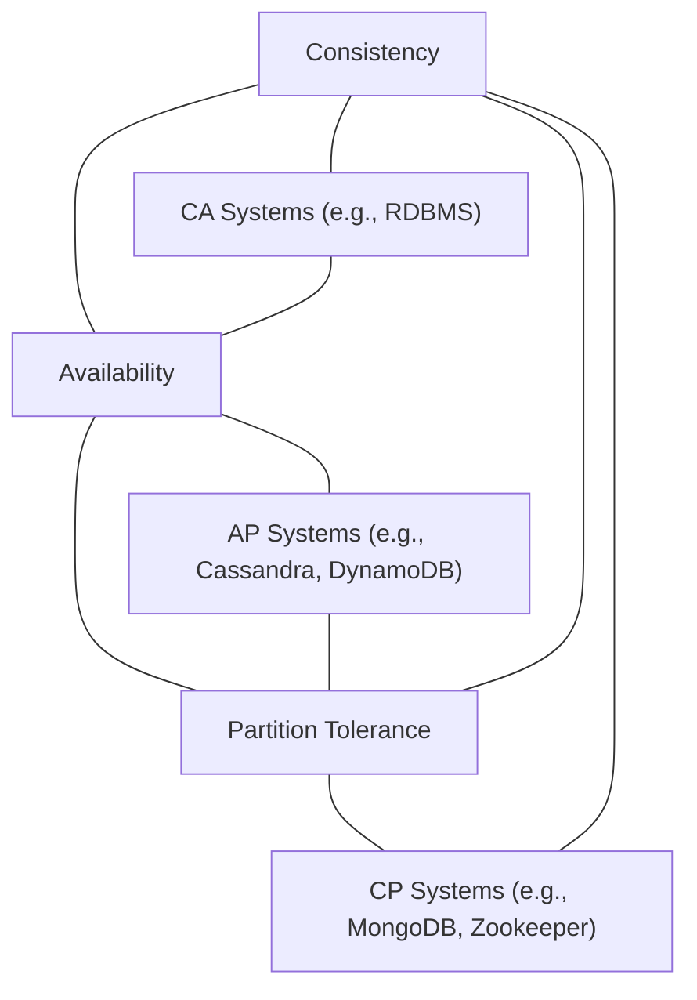

# CAP Theory
it is impossible for a distributed system to simultaneously provide all three properties: consistency, availability, and partition tolerance.

## Consistency (C)
In the context of CAP, consistency means that all nodes see the same data at the same time. More formally, every read receives the result of the most recent write – no matter which replica node it connects to.

## Availability (A)
Availability means the system always responds to requests. Every request to a non-failing node must result in some response (either the latest data or possibly stale data, but it cannot ignore you or error out).

## Partition Tolerance (P) 
Partition tolerance means the system continues to operate despite network partitions or communication failures between nodes. Network partitions will happen (due to outages, delays, etc.), so tolerance to partitions is a must.

