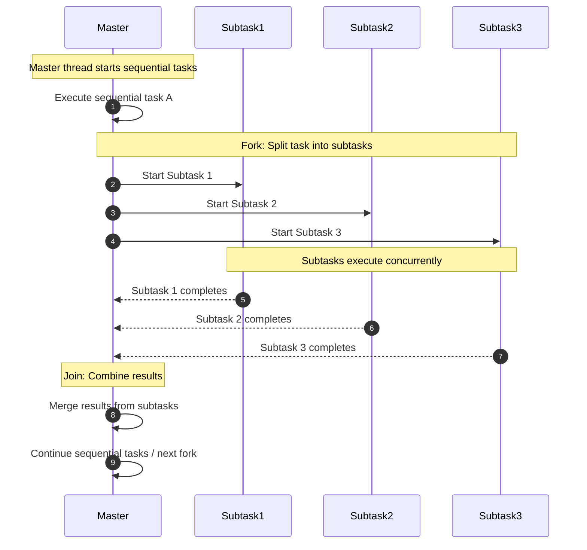
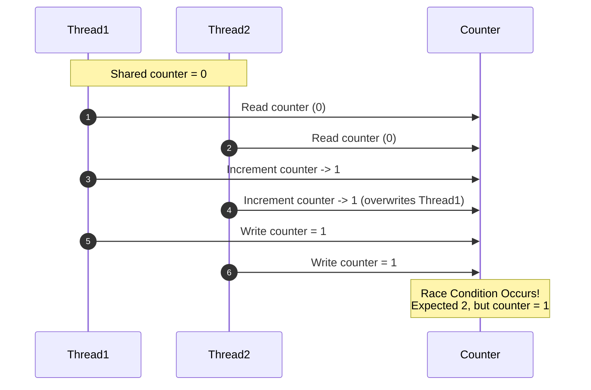

# Concurrency
 - **Multithreading** Multithreading is the ability of a central processing unit (CPU) (or a single core in a multi-core processor) to provide multiple threads of execution concurrently, supported by the operating system. A thread is the smallest sequence of programmed instructions that can be managed independently by a scheduler.
 - **Concurrency** is the execution of multiple instruction sequences at the same time. It happens in the operating system when there are several process threads running in parallel. The running process threads always communicate with each other through shared memory or message passing. Concurrency results in sharing of resources, in turn making the system efficient.


 ## Blocks of modern concurrency
 1. **Programs**: Set of instructions that perform a specific task when executed by a computer. It is a static entity that remains inactive until executed.
 2. **Process**: When run or execute a program, it becomes a process. This is the active phase of the program, using memory and other system resources. If a program is an inactive entity stored on a hard drive, a process is its active state when it's executed and begins its operations.
 3. **Thread**: Threads are parts of a process. A single process might split its task into multiple threads to work faster or more efficiently. While all threads in a process share the same resources, each thread works on its own individual task

 

## Thread Life Cycle with Concurrency
**New:** This is the phase where a thread is created but hasn’t started running. At this point, the thread is considered not alive.

**Runnable:** The thread is ready to run and is waiting for the CPU’s attention. Proper management of runnable threads ensures no thread has to wait too long, enabling faster results.

**Running:** The thread is executing its tasks. This state allows multiple threads to operate simultaneously, reducing overall processing time. The thread can move out of the Running state for various reasons, such as waiting for resources or yielding control to another thread.

**Blocked/Waiting:** The thread is in a waiting state; it is waiting on other threads to complete their tasks or some external actions.

**Terminated:** The thread has completed its tasks and exited. Managing this state well is essential for freeing up system resources.


## Components of Threads
1. **Stack Space**: Provides temporary data storage for thread operations.
1. **Program Counter**: Maintains the current position of the thread within its assigned task.
1. **Register Set**: Stores the thread's current working variables and state.

## Types of Threads
1. **User-Level Threads (ULT)**:
   - Operated and managed at the user level, invisible to the operating system, facilitating faster operations and easier management.
   - However, the entire process can become unresponsive if one thread encounters a blocking issue.
2. **Kernel-Level Threads (KLT)**: Managed directly by the operating system, integral for system stability and individual thread recovery without affecting others.

## Fork/Join Model
The Fork/Join model is a parallel programming framework that allows tasks to be divided into smaller subtasks (forked) and then combined (joined) to produce a final result.

### Initial Setup: The Master Thread
 - The process begins with a single, primary thread - often referred to as the master thread.
 - This master thread runs through the initial part of the program, executing tasks sequentially.

### Forking: Creating Subtasks
 - When the master thread encounters a task that can be parallelized, the master thread "forks" the task into multiple subtasks.
 - Each of these subtasks takes on a portion of the workload, running concurrently with others.
### Concurrent Execution: Working in Parallel
 - The master thread and the subtasks execute simultaneously.
 - This parallel execution allows for efficient utilization of system resources, as multiple tasks are handled at the same time.
### Joining: Combining Results
 - Once the subtasks complete their execution, they "join" back.
 - "Joining" involves terminating the subtasks and combining their results back to master thread.
 - The master thread then continues with the next part, now with the results or effects of the parallel tasks integrated.
### Repeat for efficiency
 - The Fork/Join cycle can repeated multiple times throughout the program.
 - The master thread can dynamically spawn and terminate threads based on the computational demands, optimizing resource usage.


 ## Example Create Thread in C#
 ```cs
using System;
using System.Threading;

class Program
{
    static void Work()
    {
        Console.WriteLine("Hello from thread");
    }

    static void Main()
    {
        Thread thread = new Thread(Work);
        thread.Start();
        
        // Wait for the thread to complete
        thread.Join();

        Console.WriteLine("Thread has completed.");
    }
}
 ```

## Critical Section
A critical section is a part of a program that accesses shared resources (like shared data structures or files) and must not be concurrently accessed by more than one thread of execution. 

```cs
using System;
using System.Threading;
class Program
{
    private static int counter = 0;
    private static readonly object lockObject = new object();

    static void IncrementCounter()
    {
        for (int i = 0; i < 100000; i++)
        {
            lock (lockObject) // Entering critical section
            {
                counter++;
            } // Exiting critical section
        }
    }

    static void Main()
    {
        Thread thread1 = new Thread(IncrementCounter);
        Thread thread2 = new Thread(IncrementCounter);

        thread1.Start();
        thread2.Start();

        thread1.Join();
        thread2.Join();

        Console.WriteLine($"Final Counter Value: {counter}");
    }
}
```

## Race Condition
A phenomenon that occurs when multiple threads access shared data and try to change it at the same time. If the access to the shared data is not properly synchronized, it can lead to inconsistent or incorrect results.

1. Thread1 and Thread2 both read the counter at the same time → both see 0.
1. Both increment their local copy → both now have 1.
1. Both write back to the shared counter → last writer wins, overwriting the first.
1. Result → The counter is 1 instead of 2.