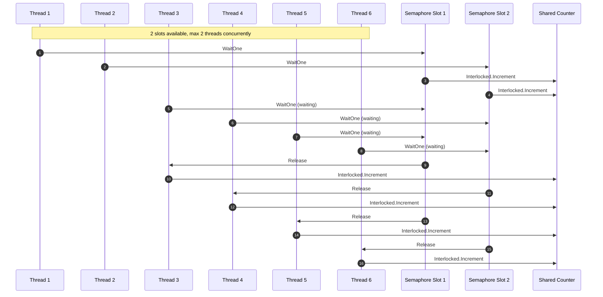

# Synchronization Constructs
Synchronization constructs are mechanisms that help manage access to shared resources in a concurrent environment, ensuring that multiple threads or processes can operate safely without causing data corruption or inconsistencies.

## Locks / Mutexes (Mutual Exclusion)
Ensuring that only one thread can access a shared resource and keeping data safe and concurrent.

We use two threads to increment the value of a counter. In one scenario, a mutex is employed to securely read and update the counter's value. In contrast, the second scenario omits the mutex, performing the same operations.
```cs
using System;
using System.Threading;

class Solution {
    static int counter;
    static readonly object lockObj = new object();

    public static void RunExperiment(string experimentName, ThreadStart task) {
        counter = 0;

        Thread t1 = new Thread(task);
        Thread t2 = new Thread(task);

        t1.Start();
        t2.Start();

        t1.Join(); // Wait for the thread to complete
        t2.Join();

        Console.WriteLine($"Final counter value {experimentName}: {counter}\n");
    }

    public static void IncrementCounterWithMutex() {
        for (int i = 0; i < 100; i++) {
            lock (lockObj) {
                int temp = counter;
                Thread.Sleep(1); // Sleep for 1 millisecond
                counter = temp + 1;
            }
        }
    }

    public static void IncrementCounterNoMutex() {
        for (int i = 0; i < 100; i++) {
            int temp = counter;
            Thread.Sleep(1); // Sleep for 1 millisecond
            counter = temp + 1;
        }
    }
}

class Program {
    static void Main() {
        Solution.RunExperiment("With Mutex Experiment", Solution.IncrementCounterWithMutex);
        Solution.RunExperiment("No Mutex Experiment", Solution.IncrementCounterNoMutex);
    }
}

//Results:
//Final counter value With Mutex Experiment: 200
//Final counter value No Mutex Experiment: 100
```

## Read-Write Locks
Or Shared-Exclusive Locks or Reader-Writer Locks are synchronization primitives that allow concurrent read access to a shared resource but require exclusive access for write operations.

 - **Read Lock**: Multiple threads can hold read locks simultaneously, allowing concurrent read access to the shared resource. As read operations do not modify the resource, they can safely occur in parallel.
 - **Write Locks**: Write lock is exclusive. Only one thread can hold a write lock at a time, ensure safe modification of the shared resource. When a thread holds a write lock, no other thread can acquire a read lock or a write lock, preventing concurrent access during write operation.

We interact with a shared variable, counter, that is accessed concurrently by multiple threads.We spawn 2 writer threads that increment the counter in a loop and 8 reader threads that continuously read its value. The program is designed to terminate once the counter reaches the TARGET_VALUE.

Key principles to note in this scenario include:

 - Multiple threads can simultaneously read the value of the counter without blocking each other.
 - A writer thread is restricted from updating the counter's value if either another writer is already performing an update, or if any readers are currently accessing the value.
 - Similarly, a reader thread is prevented from accessing the counter if a writer thread is updating its value.
```cs
using System;
using System.Collections.Generic;
using System.Threading;

class Program {
    // Global shared resource
    private static volatile int counter = 0;
    // Shared mutex for synchronization
    private static readonly ReaderWriterLockSlim mutex = new ReaderWriterLockSlim();
    // We will increment counter until it reaches TARGET_VALUE
    private const int TARGET_VALUE = 1000;

    // Write operation - Use write lock
    static int IncrementValue() {
        mutex.EnterWriteLock();
        try {
            Thread.Sleep(1); // Sleep for 1 millisecond
            if (counter < TARGET_VALUE) {
                ++counter;
            }
        } finally {
            mutex.ExitWriteLock();
        }
        return counter;
    }

    // Read operation - Use shared lock
    static int ReadValue() {
        mutex.EnterReadLock();
        try {
            Thread.Sleep(1); // Sleep for 1 millisecond
            return counter;
        } finally {
            mutex.ExitReadLock();
        }
    }

    static void Reader() {
        while (ReadValue() < TARGET_VALUE) {
            Thread.Sleep(1); // Sleep for 1 millisecond
        }
    }

    static void Writer() {
        while (IncrementValue() < TARGET_VALUE) {
            Thread.Sleep(1); // Sleep for 1 millisecond
        }
    }

    static void Main(string[] args) {
        var start = DateTime.Now;

        var readers = new List<Thread>();
        for (int i = 0; i < 8; ++i) { // 8 reader threads
            readers.Add(new Thread(Reader));
        }

        var writers = new List<Thread>();
        for (int i = 0; i < 2; ++i) { // 2 writer threads
            writers.Add(new Thread(Writer));
        }

        foreach (var reader in readers) {
            reader.Start();
        }

        foreach (var writer in writers) {
            writer.Start();
        }

        foreach (var reader in readers) {
            reader.Join();
        }

        foreach (var writer in writers) {
            writer.Join();
        }

        var end = DateTime.Now;
        TimeSpan duration = end - start;
        Console.WriteLine("Time taken: " + duration.TotalSeconds + " seconds");
    }
}
```

## Semaphore
Semaphores are synchronization primitives that control access to shared resources, maintaining an integer value to manage permits. They permit multiple threads to access a shared resource, but only up to a predetermined number of permits, ensuring smooth concurrency control in various synchronization contexts.

Types of Semaphores

 - Binary Semaphore (Mutex): Utilized for managing access to a single resource, it operates with two states, 0 and 1, ensuring mutual exclusion in critical sections.
 - Counting Semaphore: Manages access to multiple resource instances, capable of holding values greater than 1. It limits the number of simultaneous accesses to a resource.

Example shared variable named counter, we create 6 threads for this task. Each thread works to increase the counter value, but only 2 threads are allowed to do this at the same time. This limit of 2 is set by a semaphore.


Demo code will use 10 threads, 5 slots, and a semaphore to control access to the shared counter variable. The goal is for the counter to reach 5000.
```cs
using System;
using System.Threading;
using System.Diagnostics;

class SemaphoreExample {
    // Global shared resource
    // Interlocked operations are used to perform atomic operations on 'counter'
    private static int counter = 0;

    // Semaphore with a count of 5
    private static readonly Semaphore semaphore = new Semaphore(5, 5);

    private const int TARGET_VALUE = 5000;

    static void Worker() {
        while (true) {
            semaphore.WaitOne(); // Acquire the semaphore
            if (counter >= TARGET_VALUE) {
                semaphore.Release(); // Release the semaphore
                break;
            }
            Interlocked.Increment(ref counter); // Atomically increments the counter
            Thread.Sleep(1); // Simulate work
            semaphore.Release(); // Release the semaphore
        }
    }

    static void Main() {
        Stopwatch stopwatch = Stopwatch.StartNew();

        Thread[] workers = new Thread[10];
        for (int i = 0; i < workers.Length; i++) {
            workers[i] = new Thread(Worker);
            workers[i].Start();
        }

        foreach (Thread worker in workers) {
            worker.Join();
        }

        stopwatch.Stop();
        Console.WriteLine("Time taken: " + stopwatch.Elapsed.TotalSeconds + " seconds");
    }
}
```