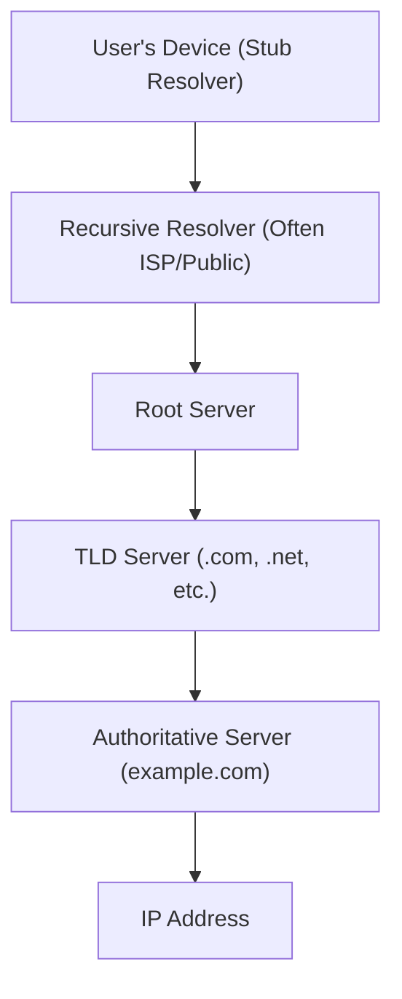

# Domain Name System (DNS)
The Domain Name System (DNS) is a hierarchical and decentralized naming system used to translate human-readable domain names (like www.example.com) into machine-readable IP addresses (like 192.0.1.1)

## Key Concepts

### 1. Domain Name
 - **Domain Names**: Human-friendly names that are easy to remember and use, such as www.example.com.
 - **Top-Level Domains (TLDs)**: The last segment of a domain name, such as .com, .org, .net, which categorize domains.
 - **Subdomains**: Divisions of a domain that can represent different sections or services, like blog.example.com.

### 2. DNS Servers
 - **Root servers**: The top-level DNS servers that direct queries to the appropriate TLD servers. There are 13 sets of root servers worldwide.
 - **TLD servers**: Store information about domain names within a specific top-level domain and direct queries to authoritative name servers.
 - **Authoritative name servers**: Hold the actual DNS records for a domain and respond to queries with the corresponding IP addresses.

1. User's Device (Stub Resolver) → Recursive Resolver
When you type a domain name like "example.com" into your browser, your device's stub resolver sends a query to a recursive resolver. The stub resolver is a simple DNS client built into your operating system that can't perform the full DNS lookup process itself. It forwards the request to a recursive resolver, which is typically provided by your ISP or a public DNS service like Google (8.8.8.8) or Cloudflare (1.1.1.1).
2. Recursive Resolver → Root Server
The recursive resolver takes on the job of finding the IP address. It starts by querying one of the 13 root DNS servers worldwide. The recursive resolver asks: "Where can I find information about .com domains?" The root server doesn't know the specific IP address for example.com, but it knows which servers handle the .com top-level domain.
3. Root Server → TLD Server
The root server responds with the addresses of the Top-Level Domain (TLD) servers responsible for .com domains. The recursive resolver then queries one of these .com TLD servers, asking: "Where can I find the authoritative server for example.com?"
4. TLD Server → Authoritative Server
The TLD server doesn't have the IP address either, but it knows which authoritative name server is responsible for the example.com domain. It responds with the address of example.com's authoritative server - this is typically managed by the domain owner or their hosting provider.
5. Authoritative Server → IP Address
Finally, the recursive resolver queries the authoritative server for example.com, asking for the specific IP address. This server has the definitive DNS records for the domain and responds with the actual IP address (like 192.0.2.1).
6. Back to User
The recursive resolver then sends this IP address back to your device's stub resolver, which passes it to your browser. Your browser can now connect directly to the web server at that IP address to load the website.
This entire process typically happens in milliseconds and involves caching at multiple levels to speed up future requests for the same domain.