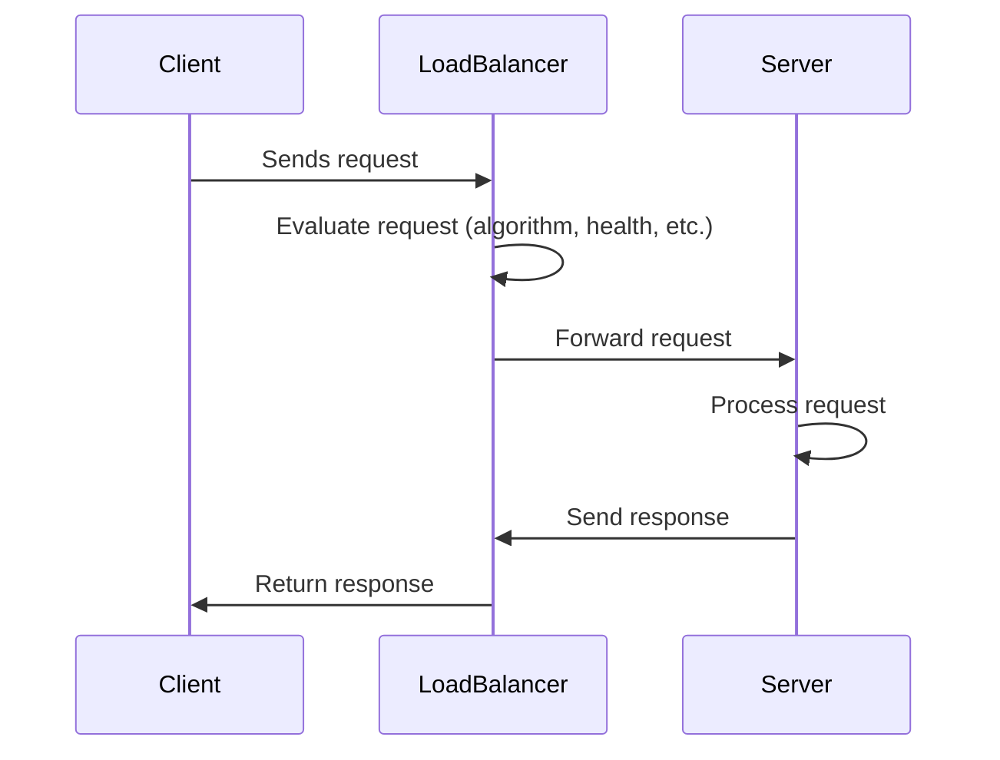
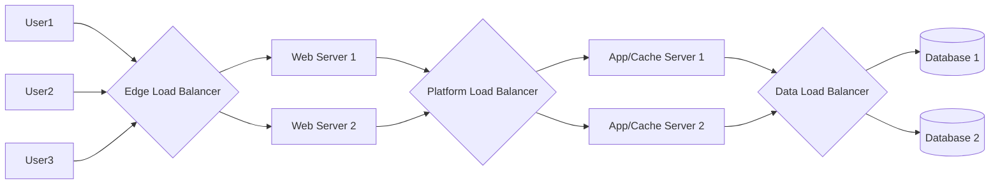

# Load balancing
Helps distribute incoming requests and traffic evenly across multiple servers.

The main goal of load balancing is to ensure high availability, reliability, and performance by avoiding overloading a single server and avoiding downtime.

## How it works
1. The load balancer receives a request from the client.
2. It selects a backend server using a load-balancing algorithm.
3. The request is forwarded to the chosen server.
4. The server processes the request and sends the response back to the load balancer.
5. The load balancer returns the response to the client.


## Each Layer
Between the user and the web servers.

Between web servers and an internal platform layer, like application servers or cache servers.

Between internal platform layer and database.


## Key terminology
- **Load balancer**: A device or software that distributes incoming network traffic across multiple servers.
- **Backend server**: The servers that receive and process requests forwarded by the load balancer. Also referred to as the server pool or server farm.
  - Server pool/server farm: This means there are multiple backend servers working together.
  - Using a pool of backend servers allows for horizontal scaling (adding more servers as needed), better fault tolerance (if one server fails, others can continue).
- **Load Balancing Algorithm**: A method used by the load balancer to determine how to distribute incoming requests among the backend servers.
- **Health Check**: Periodic tests performed by the load balancer to determine the availability and performance of backend servers. Unhealthy servers are removed from the server pool until they recover.
- **Session Persistence (Sticky Sessions)**: A technique used to ensure that a user's requests are consistently directed to the same backend server for the duration of their session. This is important for applications that maintain state information on the server side.
- **SSL/TLS Termination**: The process of decrypting SSL/TLS traffic at the load balancer level, allowing backend servers to handle unencrypted traffic. This offloads the computationally intensive task of encryption/decryption from the backend servers.
  - SSL nowadays is mostly replaced by TLS, but the term SSL is still commonly used to refer to both protocols.
    ```mermaid
    sequenceDiagram
        participant Client
        participant Server

        Client->>Server: ClientHello (TLS version, ciphers, random)
        Server->>Client: ServerHello (chosen cipher, random, certificate)
        Client->>Client: Verify certificate (CA, domain, validity)
        Client->>Server: Key exchange (RSA or ECDHE)
        Server->>Client: Key exchange confirmation
        Client->>Server: Finished (encrypted)
        Server->>Client: Finished (encrypted)
        Note over Client,Server: Secure session established 🔒
    ```
