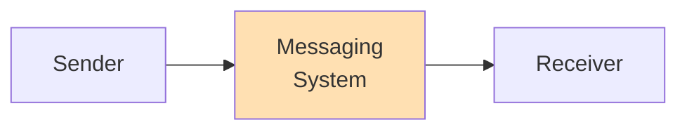
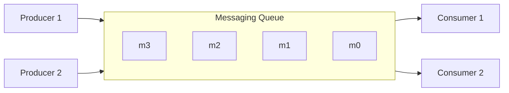
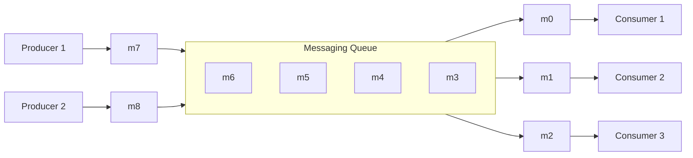
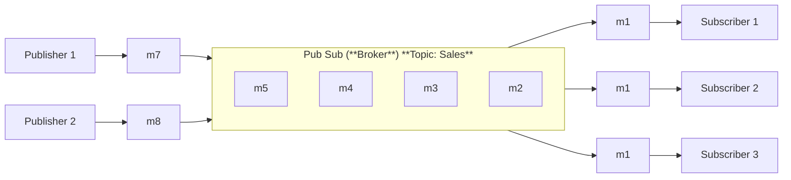

# Messaging System
Transfer data among services, applications, processes, or servers. Such a system helps decouple different parts of a distributed system, providing **asynchronous** way of communication messages between Sender and Receiver. So all senders (or producers) and receivers (or consumers) focus on the data/message without worrying about how the mechanism used to share the data.

## Queue
Messages are stored sequentially in a queue. Producers push messages to the rear of the queue, and consumers pull messages from the front of the queue (FIFO - First In, First Out).

A message can be consumed by only one consumer. Once a consumer grabs a message from the queue, it is removed from the queue which the next consumer will get the next message. This limits the system as multiple consumers cannot read the same message.

## Publish-subscribe messaging system
In the pub-sub model, messages are divided into topics.
A publisher (or a producer) sends messages to a specific topic.Subscribers (or consumers) subscribe to a topic to receive messages from the publisher. Unlike the queue system, multiple subscribers can receive the same topic.
The messaging system that stores and maintains the messages is commonly known as the message **broker**. This loose coupling enables subscribers and publishers to read and write messages at different rates.

## Message Patterns
- **Point-to-point**: A message is sent from one producer to one consumer. The message is consumed by only one consumer.
- **Publish-subscribe**: The publish-subscribe pattern delivers each message to all interested subscribers like **One-to-Many**.
- **Fan-out/Fan-in (Scatter-Gather)**: A message is sent to multiple consumers. Each consumer receives a copy of the message. And then the responses are aggregated and sent back to the producer.
- **Request-Reply**: A message is sent from a producer to a consumer, and the consumer sends a response back to the producer. This pattern is commonly used in synchronous communication but implements through messaging. Tools Like gRPC are direct request-response(not messaging), but in messaging systems can implement this pattern explicitly.
- **Dead Letter Queue**: A dead-letter queue (DLQ) is a specialized queue that stores messages that cannot be processed successfully by the primary messaging system. When a message fails to be delivered or processed after a certain number of attempts, it is moved to the DLQ for further analysis and troubleshooting. This helps prevent message loss and allows for better error handling in messaging systems.