# HTTP vs. HTTPS (In progress)

When it comes to web communication, two protocols dominate the landscape: HTTP (HyperText Transfer Protocol) and HTTPS (HyperText Transfer Protocol Secure). Understanding the differences between these two protocols is crucial for ensuring secure and efficient data transmission over the internet.

## HTTP
HTTP stands for HyperText Transfer Protocol. It's the foundational protocol used for transmitting data on the World Wide Web. When you enter a website address in your browser, HTTP is responsible for fetching and displaying that site.

### Key Features of HTTP:
- Stateless Protocol: Each request from a client to a server is independent. The server doesn't retain any session information between requests.
- Text-Based: Data is transmitted in plain text, making it readable by both humans and machines.
- Port 80: By default, HTTP uses port 80 for communication.

### Practical Use Case:
Imagine you're browsing a public blog without entering any personal information. HTTP suffices here because the data exchanged isn't sensitive. The speed of HTTP can be advantageous in such scenarios where security isn't a primary concern.

## HTTPS
HTTPS stands for HyperText Transfer Protocol Secure. It's an extension of HTTP with added security measures to protect data during transmission.

### Key Features of HTTPS:
- Encryption: Uses protocols like SSL/TLS to encrypt data, ensuring that any intercepted information remains unreadable.
- Authentication: Verifies that the website you're connecting to is legitimate, preventing man-in-the-middle attacks.
- Data Integrity: Ensures that data isn't tampered with during transmission.
- Port 443: HTTPS operates over port 443.

### Practical Use Case:
When you're shopping online, entering personal details, or accessing your bank account, HTTPS is essential. It safeguards your sensitive information from potential eavesdroppers and ensures that your data reaches the intended server securely.

## TLS Handshake Process
SSL (Secure Sockets Layer) and TLS (Transport Layer Security) are cryptographic protocols that secure communication over networks. TLS is the modern successor to SSL, though the terms are often used interchangeably.

```mermaid
sequenceDiagram
    participant Client as Client (Browser)
    participant Server as Server (Website)
    participant CA as Certificate Authority
    
    Note over Client, Server: TLS Handshake Process
    
    Client->>Server: 1. Client Hello
    Note right of Client: • Supported TLS versions<br/>• Cipher suites<br/>• Client random number
    
    Server->>Client: 2. Server Hello + Certificate
    Note left of Server: • Selected TLS version<br/>• Selected cipher suite<br/>• Server random number<br/>• Digital certificate
    
    Client->>CA: 3. Certificate Verification
    Note over Client, CA: Verify certificate against trusted CAs
    CA-->>Client: Certificate Valid ✓
    
    Client->>Server: 4. Key Exchange
    Note right of Client: • Pre-master secret encrypted<br/>with server's public key
    
    Note over Client, Server: 5. Both generate session keys from:<br/>Client random + Server random + Pre-master secret
    
    Client->>Server: 6. Client Finished (encrypted)
    Server->>Client: 7. Server Finished (encrypted)
    
    Note over Client, Server: 🔒 Secure Connection Established
    
    Client<<->>Server: 8. Encrypted Application Data
```

**Step-by-step details:**
- **Step 1**: Client Hello
The client (your browser) initiates the connection by sending a "Client Hello" message to the server containing:
  - Supported TLS versions (e.g., TLS 1.2, TLS 1.3)
  - Cipher suites - A list of encryption algorithms the client can use
  - Client random number - A randomly generated value used later for key generation

- **Step 2**: Server Hello + Certificate
The server responds with multiple pieces of information:
  - Selected TLS version - Chooses the highest version both sides support
  - Selected cipher suite - Picks one from the client's list that it also supports
  - Server random number - Another random value for key generation
  - Digital certificate - Contains the server's public key and identity information

- **Step 3**: Certificate Verification
The client validates the server's certificate by:
 - Checking against trusted Certificate Authorities (CAs) - Verifies the certificate was signed by a trusted CA
 - Validating the certificate chain - Ensures the certificate is legitimate and not expired
 - Confirming domain match - Ensures the certificate matches the website domain

- **Step 4**: Key Exchange
The client generates and sends the key material:
 - Pre-master secret - A random value encrypted with the server's public key
 - Only the server can decrypt this using its private key (ensuring only the legitimate server can proceed)

- **Step 5**: Session Key Generation (Both Sides)
Both client and server independently generate identical session keys using:
  - Client random number (from Step 1)
  - Server random number (from Step 2)
  - Pre-master secret (from Step 4)
  - These are fed into a key derivation function to create the symmetric encryption keys

- **Step 6**: Client Finished
The client sends a "Finished" message that is:

Encrypted with the new session keys - Proves the client has the correct keys
Contains a hash of all handshake messages - Ensures nothing was tampered with

- **Step 7**: Server Finished
The server sends its own "Finished" message:

Also encrypted with session keys - Confirms the server has the correct keys
Verifies the handshake integrity - Ensures both sides agree on what happened

- **Step 8**: Secure Connection Established 🔒
From this point forward:

All data is encrypted using the symmetric session keys
Both confidentiality and integrity are maintained
The connection is authenticated - You know you're talking to the right server