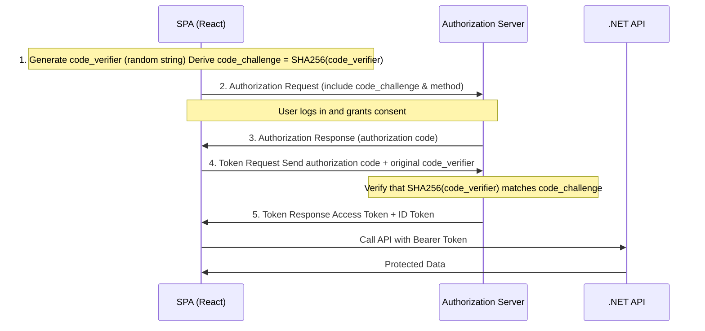
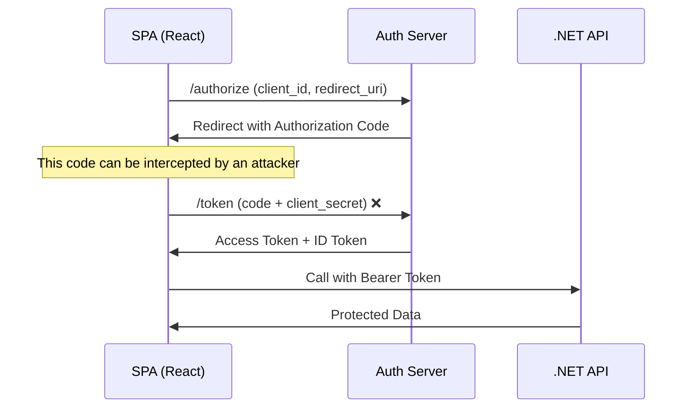

# Security

## Authentication
the process verifying the identity of a user or system, typically through credentials like usernames and passwords, biometrics, or tokens.
 1. **Single-Factor Authentication (SFA)**: Involves one method of verification, such as a password or PIN.
 2. **Two-Factor Authentication (2FA)**: Requires two different forms of verification, such as a password and a code sent to a mobile device.
 3. **Multi-Factor Authentication (MFA)**: Involves two or more verification methods, enhancing security by combining something you know (password), something you have (smartphone), and something you are (fingerprint) and maybe a token.

 ## Authorization
 After authentication, authorization determines what resources and actions the authenticated user or system is permitted to access. Common models include:
    1. **Role-Based Access Control (RBAC)**: Access is granted based on the user's role within an organization (e.g., admin, user, guest).
    2. **Permissions**: Access is granted based on specific permissions assigned to users or groups, like read, write, or execute permissions.

| Aspect            | Authentication                                      | Authorization                                          |
|--------------------|----------------------------------------------------|--------------------------------------------------------|
| **Definition**     | The process of verifying who a user is.            | The process of verifying what access a user has.       |
| **Focus**          | Identity verification.                             | Access rights and privileges.                          |
| **Example**        | Entering a username and password.                  | Checking if a user can access a specific resource, like a file or database. |
| **How It Works**   | Typically involves passwords, biometrics, OTPs, etc.| Involves settings, roles, and permissions that define what resources a user can access. |
| **Tools/Methods**  | Login forms, OTPs, biometric scanners.             | Access control lists, role-based access control.       |
| **Order in Process** | Comes first in the security process.              | Follows after authentication is successful.            |
| **Key Concern**    | Verifying user identity is genuine.                | Managing user permissions and access levels.           |
| **Frequency**      | Typically occurs once at the beginning of a session.| Can occur multiple times, whenever a user requests access to a resource. |
| **Dependence**     | Independent process, can exist without authorization in some systems. | Requires authentication as a prerequisite.             |

## OAuth
OAuth (Open Authorization) is an open standard for access delegation commonly used to grant websites or applications limited access to user information without exposing passwords.

### Key Components of OAuth
- **Delegation**: OAuth allows users to delegate access to their resources on one site (the resource server) to another site (the client) without exposing their credentials.
- **Tokens**: OAuth uses access tokens to grant access to resources. These tokens are issued to the client by the authorization server after the user grants permission.
- **Use Cases**: Commonly used for third-party applications to access user data on platforms like Google, Facebook.

## JWT (JSON Web Token)
Is a token format used in authorization and information exchange. It’s a JSON object encoded as a string, which is digitally signed, and optionally encrypted. After a user logs in, the server creates a JWT with user information, signs it, and sends it back to the client. The client then uses this JWT to access protected resources by sending it with HTTP requests.

### Characteristics
- **Authentication & Information Exchange**: JWT can be used for both authentication and secure data exchange.
- **Structure**: A JWT typically consists of three parts: Header, Payload, and Signature.
- **Stateless**: JWTs are self-contained, allowing stateless authentication, and are typically used in RESTful APIs.
- **Use Cases**: Often used for token-based authentication systems.

### Conclusion
Both OAuth and JWT are essential components in modern web security, often used together to provide secure.
- **Complementary Technologies**: In many implementations, OAuth uses JWT as the format for its tokens. OAuth manages the authorization process, and JWT provides a secure token format.
- **Use JWT for**: Securely transmitting information between parties and stateless authentication.
- **Use OAuth for**: Delegating access to user data to third-party applications without exposing user credentials.

## Proof Key for Code Exchange by OAuth Public Clients (PKCE)
PKCE (pronounced "pixy") is an extension to the OAuth 2.0 authorization framework that enhances security for public clients, such as mobile and single-page applications (SPAs), which cannot securely store client secrets. PKCE mitigates the risk of authorization code interception attacks by adding an additional layer of security during the OAuth 2.0 authorization code flow.

### How PKCE Works
1. **Code Challenge and Code Verifier**: The client generates a random string called the "code verifier" and derives a "code challenge" from it using a transformation method (usually SHA256).
2. **Authorization Request**: The client initiates the OAuth 2.0 authorization request, including the code challenge and the method used to derive it.
3. **Authorization Response**: The authorization server responds with an authorization code if the user grants permission.
4. **Token Request**: The client sends a token request to the authorization server, including the authorization code and the original code verifier.
5. **Token Response**: The authorization server verifies the code verifier against the code challenge. If they match, it issues an access token to the client.

### without PKCE
If an attacker sniffs the authorization code during the redirect, they can call the token endpoint and get your tokens (since nothing ties the code to the client).

## Encryption
Encryption is the process of converting plaintext data into a coded format (ciphertext) to prevent unauthorized access.
- **Symmetric Encryption**: Uses the same key for both encryption and decryption. AES (Advanced Encryption Standard), DES (Data Encryption Standard) are common symmetric algorithms.
- **Asymmetric Encryption**: Uses a pair of keys (public key and private key). The public key encrypts the data, and the private key decrypts it. RSA (Rivest-Shamir-Adleman) and ECC (Elliptic Curve Cryptography) are popular asymmetric algorithms.

## Cryptography
Cryptography is the practice of encrypting and decrypting data using mathematical algorithms. It's used for secure communication, data privacy, and authentication.
- **Hashing**: (one-way, fixed-size output)
    - Algorithms: SHA-256, SHA-3, MD5, Slow hashing -> bcrypt, scrypt, Argon2.
    - Use Cases: Password storage, data integrity verification.
    - Salting: Adding random data (salt) to input before hashing to prevent attacks like rainbow tables.
- **Digital Signatures**: A cryptographic technique that verifies the authenticity and integrity of a message or document. It uses asymmetric encryption to create a unique signature that can be verified by anyone with the public key. Common digital signature algorithms include RSA and ECDSA.
- **Message Authentication Codes (MACs)**: A short piece of information used to authenticate a message and ensure its integrity. It uses a secret key to generate a unique code that can be verified by the recipient. HMAC (Hash-based Message Authentication Code) is a common MAC algorithm.